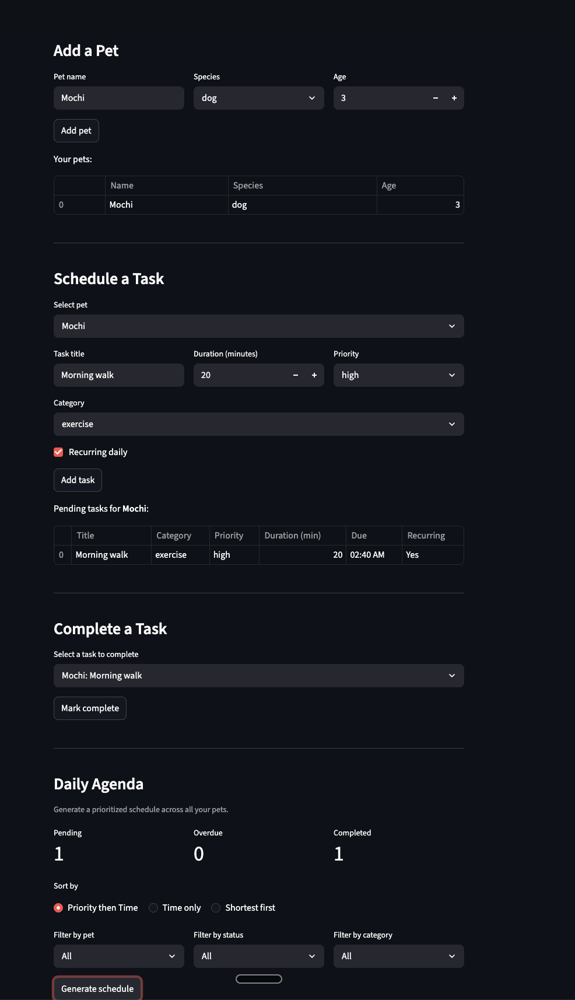

# PawPal+

**PawPal+** is a Streamlit-based pet care planning assistant that helps pet owners organize daily care tasks, track appointments, and generate smart schedules across multiple pets.

## Features

- **Multi-sort daily agenda** — View tasks sorted by priority (high first), by time (earliest first), or by duration (shortest first for a quick-win approach).
- **Task filtering** — Narrow down tasks by pet name, completion status (pending, completed, overdue), or category (exercise, feeding, grooming, medication, other).
- **Recurring task automation** — When a recurring task is marked complete, the next occurrence is automatically scheduled for the following day.
- **Conflict detection** — The system detects overlapping time windows between tasks and between appointments and tasks, displaying structured warnings instead of silently double-booking.
- **Overdue alerts** — Tasks past their due time are surfaced with prominent error banners so nothing gets missed.
- **Summary dashboard** — At-a-glance metrics show pending, overdue, and completed task counts at the top of the Daily Agenda.

## Demo



## Setup

```bash
python -m venv .venv
source .venv/bin/activate  # Windows: .venv\Scripts\activate
pip install -r requirements.txt
```

Run the app:

```bash
streamlit run app.py
```

## Architecture

The system is built around five classes defined in `pawpal_system.py`:

| Class | Responsibility |
|---|---|
| **Owner** | Manages user info and a list of pets |
| **Pet** | Stores pet details and holds tasks/appointments |
| **Task** | Represents a care activity with priority, duration, due time, and recurrence |
| **Appointment** | Represents a scheduled event (e.g. vet visit) with conflict checking |
| **PawPalSystem** | Coordinates scheduling, sorting, filtering, and conflict detection |

The final UML class diagram is saved as `uml_final.png`.

## Testing

Run the test suite with:

```bash
python -m pytest
```

The tests in `tests/test_pawpal.py` cover three core scheduling behaviors:

- **Sorting correctness** — Verifies that the daily agenda is returned in the right order for all three sort modes (priority, time, and duration), including tie-breaking within the same priority level.
- **Recurrence logic** — Confirms that completing a recurring task auto-creates the next day's occurrence, and that non-recurring tasks do not generate follow-ups.
- **Conflict detection** — Checks that overlapping task time windows are flagged as conflicts, and that non-overlapping tasks produce no false positives.

**Confidence Level:** 4/5 stars — the tests cover the most important algorithmic behaviors and all pass consistently.
