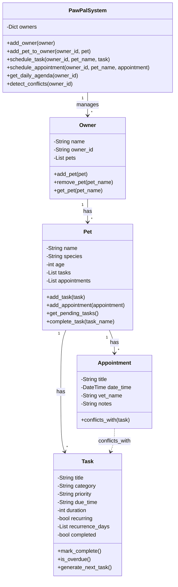

# PawPal Class Diagram

```mermaid
classDiagram
    class Owner {
        -String name
        -String owner_id
        -List pets
        +add_pet(pet)
        +remove_pet(pet_name)
        +get_pet(pet_name)
    }

    class Pet {
        -String name
        -String species
        -int age
        -List tasks
        -List appointments
        +add_task(task)
        +add_appointment(appointment)
        +get_pending_tasks()
        +complete_task(task_name)
    }

    class Task {
        -String title
        -String category
        -String priority
        -String due_time
        -int duration
        -bool recurring
        -List recurrence_days
        -bool completed
        +mark_complete()
        +is_overdue()
        +generate_next_task()
    }

    class Appointment {
        -String title
        -DateTime date_time
        -String vet_name
        -String notes
        +conflicts_with(task)
    }

    class PawPalSystem {
        -Dict owners
        +add_owner(owner)
        +add_pet_to_owner(owner_id, pet)
        +schedule_task(owner_id, pet_name, task)
        +schedule_appointment(owner_id, pet_name, appointment)
        +get_daily_agenda(owner_id)
        +detect_conflicts(owner_id)
    }

    PawPalSystem "1" --> "*" Owner : manages
    Owner "1" --> "*" Pet : has
    Pet "1" --> "*" Task : has
    Pet "1" --> "*" Appointment : has
    Appointment ..> Task : conflicts_with
```
